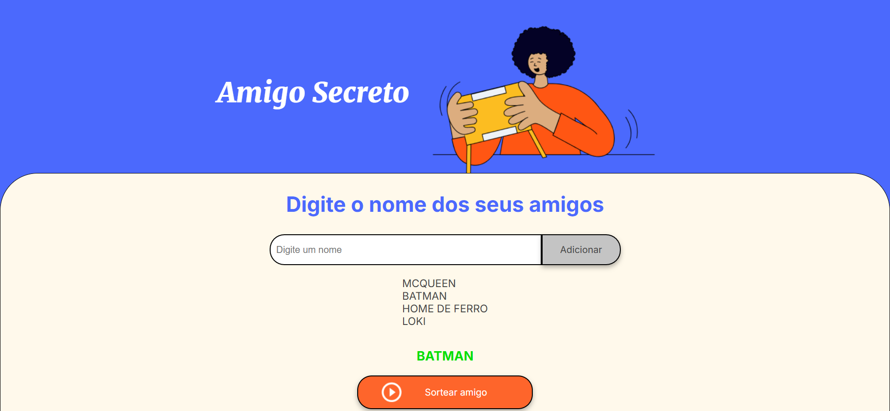

# Challenge do Amigo Secreto - Oracle Next Education (ONE) 🎉

Este projeto é uma aplicação simples desenvolvida com HTML, CSS e JavaScript, como parte do projeto Oracle Next Education (ONE). O objetivo é criar uma interface onde o usuário possa adicionar nomes de amigos a uma lista e, em seguida, sortear um nome aleatoriamente da lista. 

A lógica do sorteio é feita usando JavaScript, garantindo que um dos amigos cadastrados seja escolhido de forma aleatória cada vez que o usuário clicar no botão de "Sortear". O projeto é uma forma de praticar habilidades de programação e manipulação do DOM, além de demonstrar como integrar HTML, CSS e JavaScript para construir uma aplicação interativa.

## Funcionalidades ⚙️

- **Adicionar Amigos**: O usuário pode adicionar novos amigos à lista através de um campo de texto e um botão de "Adicionar".
- **Exibir Lista de Amigos**: A lista de amigos é exibida dinamicamente à medida que novos nomes são adicionados.
- **Sortear Amigo**: Ao clicar em "Sortear amigo", o sistema escolhe aleatoriamente um amigo da lista e exibe o nome na tela.

## Demonstração 📸

*Tela inicial do desafio*

*Tela após adicionar alguns amigos à lista, exibindo os nomes cadastrados.*

*Tela mostrando o nome do amigo sorteado após clicar no botão "Sortear amigo".*

## Acesso online 🌐

Acesse o projeto online através do link do Github Pages: [https://lukaskardeck.github.io/amigo-secreto-challenge/](https://lukaskardeck.github.io/amigo-secreto-challenge/).